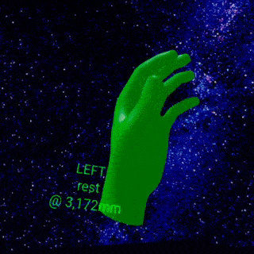

  


👉 Handy.js 👈
========================================================================
Want to add hand shape recognition to your 
[WebXR](https://developer.mozilla.org/en-US/docs/Web/API/WebXR_Device_API) 
project? **Handy** makes defining and recognizing custom hand shapes a 
snap! Why use hand-held controllers when you can use your bare hands? 👋
Built on [Three.js](https://threejs.org/) and tested on the 
[Oculus Quest](https://www.oculus.com/quest/), **Handy** recognizes 
over 100 hand shapes right out of the box—including the 
[American Sign Language (ASL) alphabet](https://en.wikipedia.org/wiki/American_Sign_Language).

**Explore the demo**.
👉 Make your hand into a “finger gun” shape, then tap your thumb down 
onto your middle finger to shoot lasers from your hand. ✊ Make a fist
to cycle through different hand model visual styles. ✌️ Make a “peace 
sign” to toggle the hand-specific colors—red for right, green for left.
This demo is live at 
[https://stewartsmith.io/handy](https://stewartsmith.io/handy)
and the open-source code repository is available at
[https://github.com/stewdio/handy.js](https://github.com/stewdio/handy.js).  
  
**Shape vs. Gesture**. 
You may notice we use the term “hand shape” rather than “hand gesture”
and that’s because “gesture” implies movement over time and a spatial
relationship to the body or other objects. Right now **Handy** is 
primarily concerned with the basic shape of a hand’s configuration.
But it’s still early days—and yes, full hand gesture recognition is on 
the roadmap 👍  
  
  


How to: Make it handy
------------------------------------------------------------------------
[Three.js](https://threejs.org/) already does the heavy lifting by
interacting with the [WebXR hand tracking 
API](https://immersive-web.github.io/webxr-hand-input/), creating a
[`THREE.Group`](https://threejs.org/docs/#api/en/objects/Group) per
each joint within a hand model, updating those joint positions /
rotations within its own update loop, and even creating multiple visual
models to use. (See Three’s [VR hand input profiles 
example](https://threejs.org/examples/#webxr_vr_handinput_profiles) and 
its [source 
code](https://github.com/mrdoob/three.js/blob/master/examples/webxr_vr_handinput_profiles.html)
for details.) But Three doesn’t include an easy way to define and listen
for hand shapes.  Here’s how easy it is to “Handify” an 
existing Three.js hand input example:

```javascript

//  Use Three.js to hookup hand inputs:

hand0 = renderer.xr.getHand( 0 )
hand1 = renderer.xr.getHand( 1 )


//  Now use Handy to “Handify” them:

Handy.makeHandy( hand0 )
Handy.makeHandy( hand1 )


//  Which one is which?
// (We won’t know until the browser returns tracking data.)

handLeft = Handy.hands.getLeft()


````

Put this one command in your animation loop to update all handified 
objects.
```javascript

Handy.update()


```

And that’s it. You’re good to go 👍  
  
  
  
  
How to: Listen for hand shapes
------------------------------------------------------------------------
**Handy** provides an `isShape` method on each hand which expects a
shape name as an argument. It returns `false` if the live hand data does
not most resemble that shape, or returns a search result object (which 
includes a reference to the shape definition data as well a `distance` 
property representing the 
[Euclidean distance](https://en.wikipedia.org/wiki/K-means_clustering))
if the live hand data does indeed most resemble the indicated shape.

```javascript

const isPeace = handLeft.isShape( 'peace' )
if( isPeace ){

	//  Do something the entire time
	//  that our hand most resembles
	//  a “peace” shape.

	//  For example, let’s log
	//  the Euclidean distance
	//  of that search result.

	console.log( isPeace.distance )
}


```

An optional second argument, a
[Euclidean distance](https://en.wikipedia.org/wiki/K-means_clustering)
threshold, follows a similar pattern as above, but does not require
that the shape be the top search result. Instead the shape must be
closer than the supplied distance threshold.

```javascript

if( handLeft.isShape( 'peace', 3000 )){

	//  Do something the entire time
	//  that our hand resembles
	//  a “peace” shape
	//  within a Euclidean distance of
	//  less than or equal to 3,000 millimeters.
}


````
  
  
**Handy** also fires events on the handified object itself to inform you
the moment a shape appears or vanishes. 

```javascript

handLeft.addEventListener( 

	'peace shape began', 
	 function( event ){

		//  Do something when the
		// “peace” shape appears.
	}
)
handLeft.addEventListener(

	'peace shape ended',
	 function( event ){

		//  Do something when the
		// “peace” shape vanishes.
	}
)


```  
The content of the passed `event` argument is:

```javascript

{
	type,    //  Event name, eg. “peace shape began”.
	hand,    //  Hand object itself.
	shape,   //  Shape definition data.
	distance,//  Euclidean distance between live hand shape and this shape.
	message  //  A human-readable description of the event, 
	         //  eg. “LEFT hand peace shape began”.
}


```
  
  
  
  
How to: Record your own hand shapes
------------------------------------------------------------------------
1. First, you will need to enable remote debugging for your Oculus Quest.
See [Oculus’ guide to enabling remote 
debugging](https://developer.oculus.com/documentation/oculus-browser/browser-remote-debugging/?device=QUEST).
 
2. To make **Handy** accessible from your [JavaScript 
console](https://developers.google.com/web/tools/chrome-devtools/console/javascript)
you must create a globally accessible reference to it in your code. For 
example, this demo declares `window.Handy = Handy`.

3. Now from your [JavaScript 
console](https://developers.google.com/web/tools/chrome-devtools/console/javascript)
you can record a new shape with something similar to the following:
`Handy.hands.getLeft().recordLiveShape( 'my shape name' )`. This will 
output a shape definition as a [JSON 
string](https://en.wikipedia.org/wiki/JSON) to your console that you 
can then paste into your shape definitions file. For this demo the 
appropriate location would be `./scripts/Handy-shapes-left.js`.
This command will _also_ add the shape into that hand’s shape library 
immediately—so your code can make use of that new hand shape in the 
very next `hand.search()` call.  
  
**Example**
```javascript

//  Shape your left hand into the Vulcan
// “Live long and prosper” salute,
//  then hit enter on the following in your console:

Handy.hands.getLeft().recordLiveShape( 'vulcan' )


//  Handy will return a snapshot of the shape.
//  Note that the position measurements are in millimeters
//  relative to the wrist joint position.

{"names":["vulcan"],"handedness":"left","handyRevision":4,"time":1598280104572,"headPosition":[-1156,5370,-2368],"headRotation":[-3.700743415417188e-17,0,0,1],"jointPositions":[[0,0,0],[32,10,-32],[51,14,-58],[77,18,-79],[90,18,-100],[41,9,-16],[96,7,-24],[132,20,-24],[154,29,-24],[176,34,-22],[41,9,-3],[96,3,-2],[134,21,-5],[159,33,-6],[183,39,-7],[38,9,8],[89,7,17],[123,23,27],[146,35,33],[168,43,39],[34,9,23],[78,14,35],[107,16,44],[123,29,46],[141,40,47]],"digitTipPositions":[[90,18,-100],[176,34,-22],[183,39,-7],[168,43,39],[141,40,47]]},


````
  
Note that the `names` property of a shape definition is an Array. One 
shape can have many names. Multiple shapes can share the same name. 
**Handy** is quite flexible and will automatically create all of the 
necessary `began`, `ended`, and `changed` events for whatever shapes 
you provide it.
  
  
  
  
Known issues
------------------------------------------------------------------------
Oculus Quest has trouble with digit overlaps as illustrated by the 
[American Sign Language (ASL)](https://en.wikipedia.org/wiki/American_Sign_Language)
shapes for **M**, **N**, **R**, **T**, **X**, and so on. This is a 
limitation of the tracking on Oculus’ side so there’s not much we can 
do about that for the moment. Take heart though: the folks over at 
Oculus have been making huge strides in what is a difficult technology 
to wrangle, and I imagine stuff like this is on their to-do list 
already.  
  
  
  
  
A note on repetition
------------------------------------------------------------------------
It’s cleaner, more legible, and easier to debug when you write logic 
once and reuse it rather than copy and paste it multiple times. This 
quickly comes into play when dealing with hands; we often must apply the 
same logic to two things at once. One clean way of doing this is using
an `Array` literal to house the two hands, then use the `Array`’s
[`forEach`](https://developer.mozilla.org/en-US/docs/Web/JavaScript/Reference/Global_Objects/Array/forEach) 
method to operate on each hand in turn. Note the semicolon prefix before
the `Array` literal. [JavaScript does not require semicolons as line
endings and I do not believe in using them as such because they are 
merely typographic 
clutter.](https://quantumjavascript.app/contributing.html#JavaScript_style)
Because of this it’s somtimes necessary to include a semicolon ahead of
an expression beginning with an `Array` literal to ensure the 
interpreter does not mistake the literal for a property accessor for a 
preceding object.

```javascript

;[ handLeft, handRight ]
.forEach( function( hand ){

	hand.addEventListener( 

		'peace shape began', 
		 onPeaceShapeBegan
	)
	hand.addEventListener(

		'peace shape ended',
		 onPeaceShapeEnded
	)
})


```  
  
  
  
  
Requirements
------------------------------------------------------------------------
This code has been designed for the [Oculus 
Quest](https://www.oculus.com/quest/) headset, though device support
will expand as more devices implement the [WebXR hand tracking 
API](https://immersive-web.github.io/webxr-hand-input/). 
Be sure your Oculus Quest has all of the latest software updates 
installed, including Oculus Browser 11.1.0.1 or later, then 
follow these steps to experience the demo for yourself:  
  
1. In the main **Settings** menu
navigate to Device → Hands and Controllers.
Enable both **Hand Tracking**
and **Auto Enable Hands or Controllers**.

2. In **Oculus Browser**
visit [chrome://flags/](chrome://flags/) 
and search for “hands” in the flags search box.

3. Within this flags page, 
set the “WebXR experiences with hands tracking” flag
(`#webxr-hands-tracking`)
to **Hands and pointers**.

4. Again, within this flags page,
set the “WebXR experiences with joints tracking” flag
(`#webxr-hands`)
to **Enabled**.

5. Restart Oculus Browser
and visit this demo again.
Use your hand controllers 
to click the “Enter VR” button.
Once you are inside the experience put your controllers down,
hold your hands out in front of you 
so that the headset can see them,
and enjoy! 👍   
  
  
  
  
Colophon
------------------------------------------------------------------------
I’m [Stewart](https://stewartsmith.io). These days I make WebXR things 
and [quantum computing things](https://quantumjavascript.app/) from my
home in Brooklyn, New York. Black lives matter.  
  
  
  
  
  
  
  
  
